# AMR Prediction Pipeline

This document describes the pipeline for training antimicrobial resistance (AMR) prediction models from EBI AMR data. The workflow is currently implemented for Klebsiella but is extensible to other species available in the EBI AMR portal.

## Overview

The pipeline takes raw EBI AMR records (antimicrobial susceptibility testing, AST), preprocesses them, downloads genome assemblies, generates protein embeddings, and fine-tunes a Bacformer model for binary AMR prediction. Each step produces outputs that feed into the next.

## Pipeline Diagram

```mermaid
flowchart LR
    subgraph step1 [1. Download]
        EBI[EBI AMR CSV]
    end

    subgraph step2 [2. Preprocess]
        Preprocess[preprocess_ebi_amr_records]
        binary_ast[binary_ast.csv]
        metadata[metadata]
    end

    subgraph step3 [3. Download Assemblies]
        DownloadBakrep[download_bakrep.sh]
        gbff[.gbff assemblies]
    end

    subgraph step4 [4. Protein Sequences]
        ProteinSeq[preprocess_assemblies_to_protein_sequences]
        parquet[protein parquet files]
    end

    subgraph step5 [5. Embeddings]
        Embed[generate_bacformer_embeddings]
        esm[ESM + Bacformer .pt]
    end

    subgraph step6 [6. Prepare Splits]
        Prepare[prepare_esmc_embeddings_and_labels_to_finetune_amr]
        ast_training[ast_training/]
    end

    subgraph step7 [7. Fine-tune]
        Finetune[train_on_slurm_finetune]
    end

    EBI --> Preprocess
    Preprocess --> binary_ast
    Preprocess --> metadata
    metadata --> DownloadBakrep
    DownloadBakrep --> gbff
    gbff --> ProteinSeq
    ProteinSeq --> parquet
    parquet --> Embed
    Embed --> esm
    binary_ast --> Prepare
    esm --> Prepare
    Prepare --> ast_training
    ast_training --> Finetune
```

## Step-by-Step Description

### 1. Download EBI AST CSV

**Manual step.** Download AMR records from the [EBI AMR portal](https://www.ebi.ac.uk/amr). Filter by species (e.g. Klebsiella pneumoniae). As of February 2026, the portal contains approximately 7,000 Klebsiella samples and ~140,000 AST records.

After download, you can explore the data using [amr_ebi_records.ipynb](notebooks/amr_ebi_records.ipynb) and the output from the preprocessing step below.

### 2. Preprocess EBI AMR records

Converts resistance phenotypes to binary (resistant/susceptible), MIC values to log scale, filters antibiotics by sample count, creates metadata and pivot tables, and generates antibiogram visualizations.

| Item | Details |
|------|---------|
| **Key input** | Raw EBI AMR CSV (from step 1) |
| **Script** | [preprocess_ebi_amr_records.py](../src/predict_kleb_by_bacformer/pp/preprocess_ebi_amr_records.py) |
| **Uses** | [convert_ast_data.py](../src/predict_kleb_by_bacformer/pp/convert_ast_data.py) |
| **Outputs** | `binary_ast.csv`, metadata CSV, regression tables, antibiogram PNG |

Note: Output filenames are currently Klebsiella-oriented (e.g. `klebsiella_ebi_metadata.csv`).

### 3. Download assemblies

Download Bakta-annotated genome assemblies from BakRep for the samples in your AST data.

| Item | Details |
|------|---------|
| **Script** | [download_bakrep.sh](../src/predict_kleb_by_bacformer/pp/pp_batch_scripts/download_bakrep.sh) |
| **Output** | `.bakta.gbff.gz` files per sample |

**Note:** The script currently reads from a fixed metadata TSV. It needs modification to accept an explicit accession list (e.g. `--sample-list accessions.txt` with one BioSample ID per line) derived from step 2 metadata. This would allow targeting the exact samples with AST data.

### 4. Extract protein sequences

Convert `.gbff` assemblies to protein sequence parquet files. This is a CPU-only step that prepares inputs for embedding generation.

| Item | Details |
|------|---------|
| **Script** | [preprocess_assemblies_to_protein_sequences.py](../src/predict_kleb_by_bacformer/pp/preprocess_assemblies_to_protein_sequences.py) |
| **Batch script** | [preprocess_protein_sequences.sh](../src/predict_kleb_by_bacformer/pp/pp_batch_scripts/preprocess_protein_sequences.sh) |
| **Input** | `.bakta.gbff.gz` files from step 3 |
| **Output** | `{sample_id}_protein_sequences.parquet` |

### 5. Generate embeddings

Generate ESM and Bacformer protein embeddings using GPU. The script currently produces both ESM and Bacformer embeddings; it can be modified to produce ESM-only if Bacformer embeddings are not needed (e.g. for AMR prediction, only ESM embeddings are used by the training pipeline).

| Item | Details |
|------|---------|
| **Script** | [generate_bacformer_embeddings.py](../src/predict_kleb_by_bacformer/pp/generate_bacformer_embeddings.py) |
| **Batch script** | [run_bacformer_embeddings_array.sh](../src/predict_kleb_by_bacformer/pp/pp_batch_scripts/run_bacformer_embeddings_array.sh) (sbatch) |
| **Input** | Protein sequence parquet files from step 4 |
| **Output** | `{sample_id}_esm_embeddings.pt`, `{sample_id}_bacformer_embeddings.pt` |

### 6. Prepare AST splits

Creates train/validate/evaluate splits (70/10/20), merges AST labels into pytorch (.pt) files, and prunes samples without embedding files. The output is ready for fine-tuning.

| Item | Details |
|------|---------|
| **Script** | [prepare_esmc_embeddings_and_labels_to_finetune_amr.py](../src/predict_kleb_by_bacformer/pp/prepare_esmc_embeddings_and_labels_to_finetune_amr.py) |
| **Input** | `binary_ast.csv`, ESM embedding pytorch (.pt) files |
| **Output** | `ast_training/{train,validate,evaluate}/` with `{sample_id}_with_ast.pt`, `binary_ast_with_split.csv` |

### 7. Fine-tune

Bacformer fine-tuning for binary AMR prediction per antibiotic.

| Item | Details |
|------|---------|
| **Script** | [train_on_slurm_finetune.sh](../slurm_scripts/train_on_slurm_finetune.sh) |
| **Input** | `ast_training/` splits, `binary_ast_with_split.csv` |

## Key File Dependencies

| Step | Inputs | Outputs |
|------|--------|---------|
| 1 | — | EBI AMR CSV |
| 2 | EBI AMR CSV | `binary_ast.csv`, metadata, regression_log_mic.csv, antibiogram |
| 3 | Metadata / sample list | `.bakta.gbff.gz` assemblies |
| 4 | `.bakta.gbff.gz` | `*_protein_sequences.parquet` |
| 5 | `*_protein_sequences.parquet` | `*_esm_embeddings.pt`, `*_bacformer_embeddings.pt` |
| 6 | `binary_ast.csv`, `*_esm_embeddings.pt` | `ast_training/`, `binary_ast_with_split.csv` |
| 7 | `ast_training/`, `binary_ast_with_split.csv` | Fine-tuned model checkpoints |

## Adapting for Other EBI Species

To run the pipeline for a different species:

1. **Step 1:** Change the species filter when downloading from the EBI AMR portal.
2. **Paths:** Adjust paths in `data_paths.py` and script defaults (input/output directories, embedding dirs, etc.).
3. **Preprocessing:** The EBI format is generic; [convert_ast_data.py](../src/predict_kleb_by_bacformer/pp/convert_ast_data.py) and [preprocess_ebi_amr_records.py](../src/predict_kleb_by_bacformer/pp/preprocess_ebi_amr_records.py) work for any EBI AMR species. You may want to make output filenames configurable (e.g. species prefix).
4. **Steps 3–7:** Same scripts; point them at the new data directories.

## Notebooks

- [amr_ebi_records.ipynb](notebooks/amr_ebi_records.ipynb) — Explore EBI AMR data and preprocess output.
