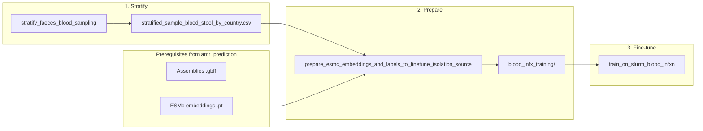

# Blood vs Stool (Isolation Source) Prediction Pipeline

This document describes the pipeline for predicting blood infection (blood=1) vs stool (faeces & rectal swabs=0) from genome embeddings. It reuses assemblies and ESMc embeddings from the [AMR prediction pipeline](amr_prediction.md); only the sample selection and label preparation differ.

## Overview

The pipeline predicts `blood_infxn` (binary: blood vs stool) from `isolation_source_category` in metadata. Samples are selected by stratified sampling, then ESMc embeddings and labels are combined for Bacformer fine-tuning.

## Prerequisites (from AMR pipeline)

- **Assemblies:** Already downloaded (see [amr_prediction.md](amr_prediction.md) steps 3–4: download assemblies, extract protein sequences).
- **ESMc embeddings:** Prepared by the same pipeline (step 5 in amr_prediction.md: [generate_bacformer_embeddings.py](../src/bacotype/pp/generate_bacformer_embeddings.py) via sbatch).

No separate download or embedding step is needed for blood prediction; it uses the same `klebsiella_esm_embeddings` directory.

## Pipeline Steps

### 1. Stratified sample selection

Samples are selected by stratified sampling to balance blood and faeces/rectal swab counts across countries.

| Item | Details |
|------|---------|
| **Script** | [stratify_faeces_blood_sampling.py](../src/bacotype/pp/stratify_faeces_blood_sampling.py) |
| **Input** | Metadata with `sample_accession`, `isolation_source_category`, `country` (or similar) |
| **Output** | `stratified_sample_blood_stool_by_country.csv` |

### 2. Prepare splits

Combines ESMc embeddings with blood_infxn labels, creates train/validate/evaluate splits (70/10/20), and prunes samples without embeddings.

| Item | Details |
|------|---------|
| **Script** | [prepare_esmc_embeddings_and_labels_to_finetune_isolation_source.py](../src/bacotype/pp/prepare_esmc_embeddings_and_labels_to_finetune_isolation_source.py) |
| **Input** | `stratified_sample_blood_stool_by_country.csv`, ESM embedding pytorch (.pt) files |
| **Output** | `blood_infx_training/{train,validate,evaluate}/` with `{sample_id}_with_blood_infx.pt`, `binary_blood_infxn_with_split.csv` |

### 3. Fine-tune

Bacformer fine-tuning for binary blood_infxn prediction.

| Item | Details |
|------|---------|
| **Script** | [train_on_slurm_blood_infxn.sh](../slurm_scripts/train_on_slurm_blood_infxn.sh) |
| **Input** | `blood_infx_training/` splits, `binary_blood_infxn_with_split.csv` |

## Summary

