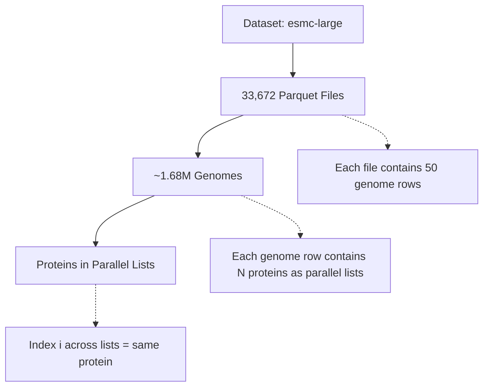

# ESMC Embedding Parquet Files

## Dataset Overview

- **Location:** `/projects/public/u5ah/data/genomes/atb/esmc-large`
- **Total Files:** 33,672 parquet files
- **Total Genomes:** ~1.68 million (50 genomes per file)
- **Estimated Total Size:** ~14.7 TB (average 436 MB per file)
- **File Naming:** `embeddings_*.parquet`

## Data Structure

### High-Level Organization



### Row Structure

Each **row** represents one complete genome:
- **1 scalar field:** `genome_id` (unique identifier)
- **9 parallel list fields:** All protein data stored as lists of equal length
- The **'genome_id'** identifier matches the **sample_accession** identifier in NCBI, EBI and ATB starting SAMN"

## Schema

| Column Name | Type | Description |
|-------------|------|-------------|
| `genome_id` | `string` | **Scalar.** Unique genome identifier (e.g., "SAMN16606182") |
| `accession_id` | `list<string>` | **List.** Contig-level identifiers for each protein |
| `start` | `list<int64>` | **List.** Genomic start position for each protein |
| `end` | `list<int64>` | **List.** Genomic end position for each protein |
| `strand` | `list<int64>` | **List.** Strand orientation for each protein (-1 or 1) |
| `contig_name` | `list<string>` | **List.** Contig assignment for each protein |
| `protein_sequence` | `list<string>` | **List.** Amino acid sequence for each protein |
| `protein_embedding` | `list<list<float>>` | **List.** 1152-dimensional ESMC embedding for each protein |
| `indices` | `list<int64>` | **List.** Cluster assignment index for each protein |
| `distances` | `list<float>` | **List.** Distance to cluster center for each protein |

## Critical: Parallel List Structure

The 9 list columns form **parallel arrays** where the same index refers to the same protein:

```python
# For protein at index i:
protein_i = {
    'accession': accession_id[i],  # Genome name
    'position': (start[i], end[i]), 
    'strand': strand[i],
    'contig': contig_name[i],
    'sequence': protein_sequence[i],      # Amino acid string
    'embedding': protein_embedding[i],    # 1152-dimensional array
    'cluster_id': indices[i],
    'cluster_dist': distances[i]
}
```

### Example Data

For genome `SAMN16606182` with 4,773 proteins:
- All list columns have length 4,773
- `protein_sequence[0]` = "MLLKDPAFRAAYEAESQNPQSGYQIIRHHGDGTEEVVFDSRVSGTDLPTNWMNRPDW"
- `protein_embedding[0]` = array of shape (1152,) with dtype float32
- `contig_name[0]` = "SAMN16606182.fa_SAMN16606182.contig00001"

## Contig Organization

**Important:** Contigs are **not a nesting level** in the storage structure. They are a grouping attribute.

- Multiple proteins can belong to the same contig
- Proteins from the same contig have the same `contig_name[i]` value
- To get all proteins from a specific contig, filter by matching `contig_name`

```python
# Group proteins by contig
contig_proteins = {}
for i in range(len(contig_name)):
    contig = contig_name[i]
    if contig not in contig_proteins:
        contig_proteins[contig] = []
    contig_proteins[contig].append(i)
```

## Protein Embeddings

- **Model:** ESMC-large (Evolutionary Scale Modeling - Genomic)
- **Dimension:** 1152 float32 values per protein
- **Input:** Amino acid sequence (`protein_sequence[i]`)
- **Output:** Fixed-length embedding vector (`protein_embedding[i]`)
- **Purpose:** Learned representation capturing protein structure and function

## Reading the Data

### Load a Single File

```python
import pandas as pd
import pyarrow.parquet as pq

# Read one parquet file
df = pd.read_parquet('/projects/public/u5ah/data/genomes/atb/esmc-large/embeddings_0_5500_0.parquet')

print(f"Genomes in file: {len(df)}")
print(f"Columns: {list(df.columns)}")
```

### Access a Specific Genome

```python
# Get first genome
genome_row = df.iloc[0]
genome_id = genome_row['genome_id']
num_proteins = len(genome_row['protein_sequence'])

print(f"Genome: {genome_id}")
print(f"Number of proteins: {num_proteins}")
```

### Iterate Over Proteins in a Genome

```python
# Access all proteins for a genome
genome_row = df.iloc[0]

for i in range(len(genome_row['protein_sequence'])):
    protein = {
        'accession': genome_row['accession_id'][i],
        'contig': genome_row['contig_name'][i],
        'start': genome_row['start'][i],
        'end': genome_row['end'][i],
        'strand': genome_row['strand'][i],
        'sequence': genome_row['protein_sequence'][i],
        'embedding': genome_row['protein_embedding'][i],  # Shape: (1152,)
        'cluster': genome_row['indices'][i],
        'distance': genome_row['distances'][i]
    }
    # Process protein...
```

### Filter Proteins by Contig

```python
# Get all proteins from a specific contig
genome_row = df.iloc[0]
target_contig = "SAMN16606182.fa_SAMN16606182.contig00001"

contig_protein_indices = [
    i for i, contig in enumerate(genome_row['contig_name']) 
    if contig == target_contig
]

print(f"Proteins in {target_contig}: {len(contig_protein_indices)}")
```

### Access Embeddings

```python
import numpy as np

# Get embedding for first protein
genome_row = df.iloc[0]
embedding = genome_row['protein_embedding'][0]  # numpy array

print(f"Embedding shape: {embedding.shape}")      # (1152,)
print(f"Embedding dtype: {embedding.dtype}")      # float32
print(f"Sample values: {embedding[:10]}")         # First 10 dimensions
```

## Dataset Statistics

Based on sampling:

- **Genomes per file:** 50 (consistent)
- **Proteins per genome:** Varies (example: ~4,773)
- **File size:** Average ~436 MB per file
- **Total storage:** ~14.7 TB for full dataset
- **Total genomes:** 33,672 files × 50 = **1,683,600 genomes**

## Use Cases

This dataset enables:

1. **Genome-wide protein analysis:** Access all proteins for any genome
2. **Protein clustering:** Pre-computed cluster assignments in `indices` and `distances`
3. **Embedding-based similarity:** Compare proteins using 1152-dimensional embeddings
4. **Contig-level analysis:** Group proteins by genomic contigs
5. **Sequence-structure relationships:** Link amino acid sequences to learned embeddings

## Notes

- Each genome row is self-contained with all its protein data
- Parallel list structure requires keeping indices synchronized
- Embeddings are pre-computed and ready for downstream analysis
- Large dataset size requires careful memory management when processing multiple files
